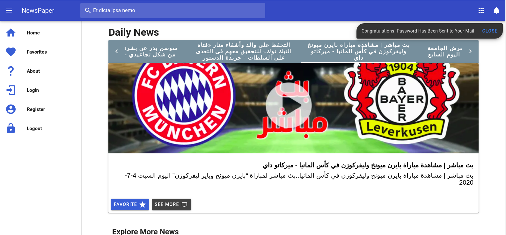

# Newspapers Full Stack Project Using Laravel/Reactjs
This Project Related to News Web Application Where User can Browse top headlines about business and sports in Egypt

# Project Dependencies
  - Php (Laravel Framework )
  - Mysql
  - Vuejs
  - Vuex ( State Management ) Handle State Over Application
  - Passport
  - RESTful Api's
  - Google Service To Send Message with Auto Generated Password to User Email
  - open source NEWS API (https://newsapi.org/) to retrieve news updates
  - Task Scheduling (Cron Jobs) To Automate Fetching News At Back-end
  
# Features
  - Automate Fetching Latest News ( Task Scheduling )
  - Vuex For State Management Over the Application
  - Responsive Website
  - Authentication With Passport & Veux
  - Browse top headlines about business and sports in Egypt
  - Add/Remove Favorites News
  - Browse User Favorites Easily
  - Send Mail With auto generated Password When User Register
  - Route Guards
  - Application Testing
  
# Project Workflow
  ## Back-End
   - Setting up Database Migration
  - Start Creating Model And Controller
  - Create Apis & Request Validation
  - Setup My Schema Relationships Between Articles & Users
  - Start Writing my Controller Functionality
  - Configure Send Mail Service Where User Register
  - Communicate With External Api Using Guzzle
  - Automate Fetching Latest News With Laravel Task Scheduling (Cron Jobs)
  ## Front-End
  - Start Create Front-end UI with Veutify-ui
  - Start Setup Vuex Modules ( Handle State Management Over Application )
  - Finished Authentication Senario With Token
  - handle Server Side and Client Side Validation
  - Create Routes Guards 
  - Create Project Services To separate Fetching Data From Component
  - Makes Reusable Component That List News
  - Provide Very Smaller Components to be easy to Maintain
  - Fetching Top-headlines in Egypt From Back-end
  - Makes Add/Remove News Favorites Component To Reusable it in Several Places
  - Creating User Favorites Component
  ## Testing
  - Start Writing Tests
  - Test Best & Worst Cases Scenarios
  ## Deploy With Docker
  - Working On It
  
# Project Pictures

